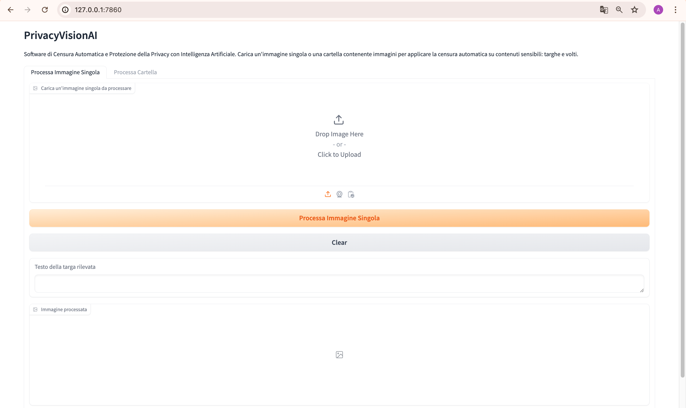

# PrivacyVisionAI
PrivacyVisionAI is an innovative software solution dedicated to enhancing privacy and security within images through the use of artificial intelligence.
My personal thesis work concerns AI using the following technologies:
- Ultralytics YOLOv8 
- pre-trained model for OCR via Roboflow API
- OpenCV library for image processing
- Gradio API for GUI development

## Instructions for using the software:
- Give permissions to run the start scrpit. Open the terminal in the project folder and run the following command:

  chmod +x start.sh
- Run the start script:

  ./start.sh
  
## Example of use

